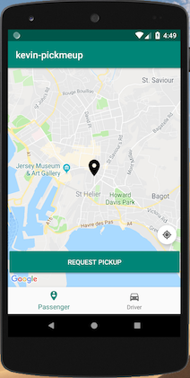
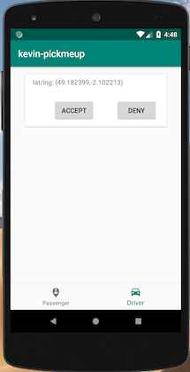

# Pickmeup App

## Pre-requisites

### a. Install android studio

### b. Install android SDK

### c. Create android emulator

## Steps to run the application

### 1. Setup Google maps API key

-Create a file called 'api-keys.xml' in res/values folder
-Paste in the following code
`<resources>
    <string name="GoogleMapsKey">CODE_HERE</string>
</resources> `

### 2. Connect to google firebase

-Select 'Tools' > 'Firebase' and select 'Realtime Database' then follow the steps in the guide

### 3. Click run